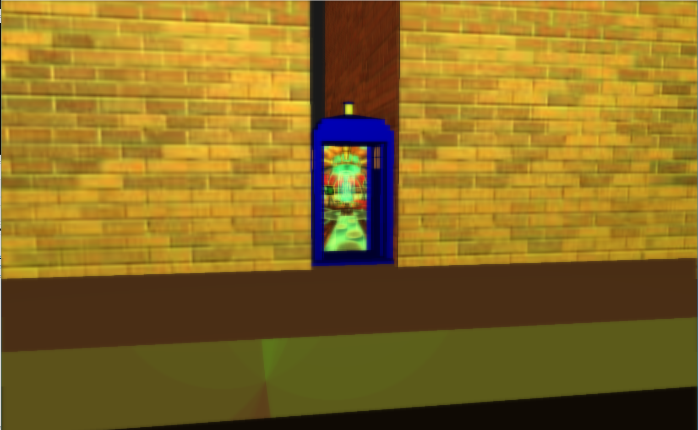
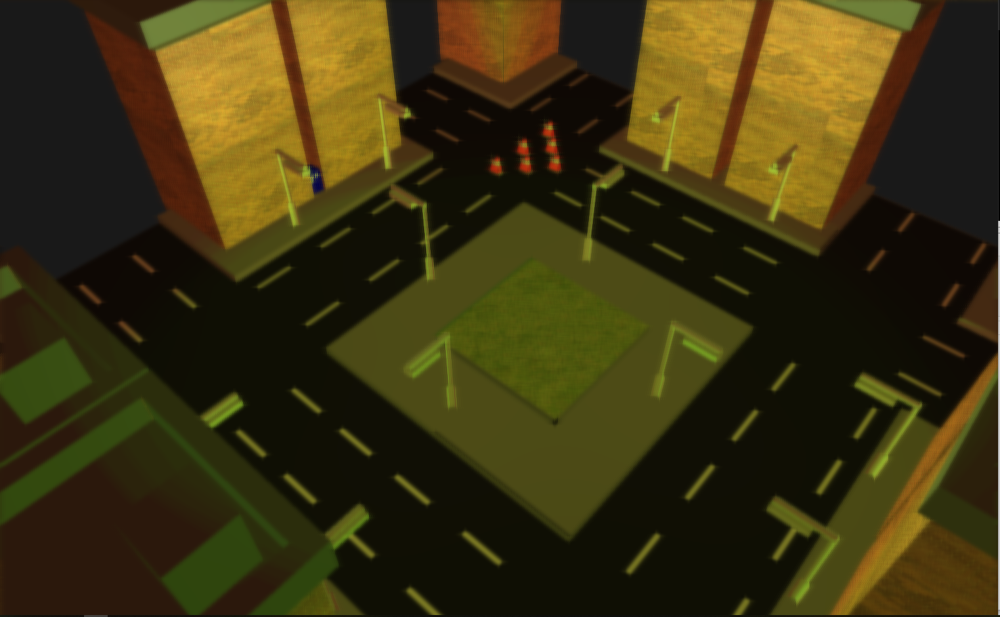
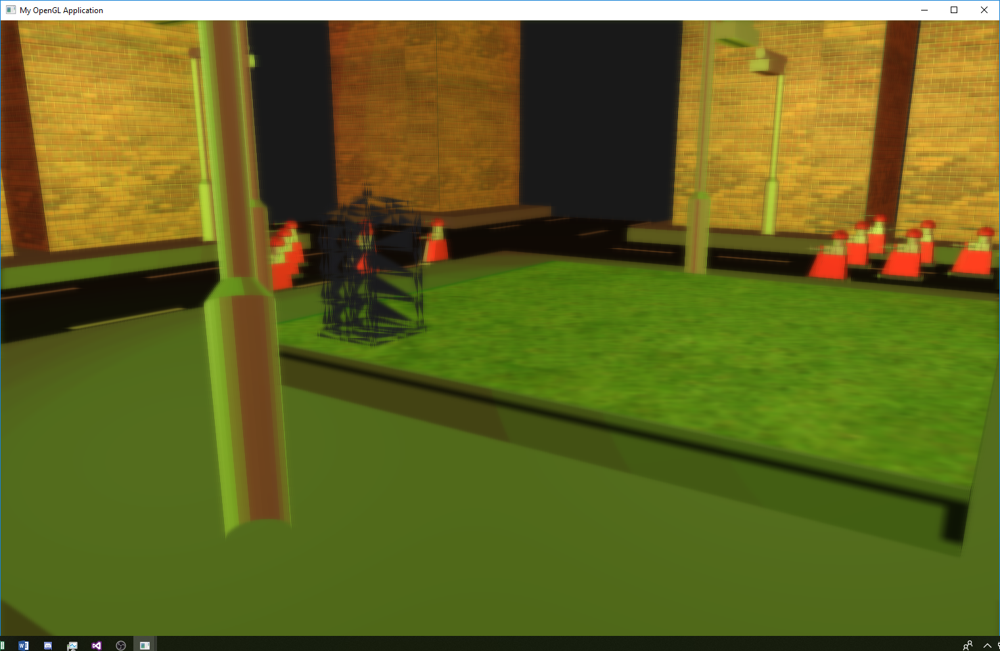

# OpenGL 3D Scene

## About

This was created as part of my 3D graphics and animation module. The task that was set was to create a scene using OpenGL, the scene had to include interaction, animation and lighting.

### Technology used

* C++
* Visual Studio
* OpenGL
* Blender

## Interaction
I added simple interaction by allowing the user to open the doors of the police telephone box in the scene.

## Lighting

I added robots and lamp posts to thte city scene I had created. I then added 24 lights of different colours to give the effect. I added these lights to the bottom of the robots and the to the top of the lamp posts

## Animation

For animation, as well as having the doors of the police telephone box open. I had the whole object slowly disapear by reducing the number of points for OpenGl to draw.

